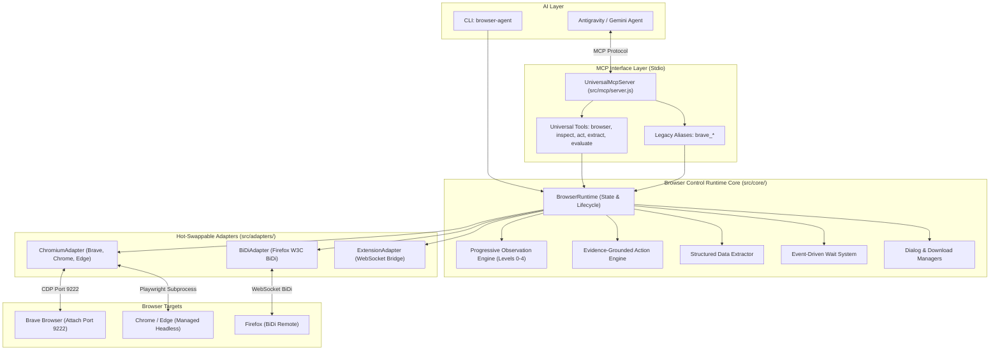

# Universal Browser Control Runtime (`browser-activity`)

[](package.json)
[](https://modelcontextprotocol.io/)
[](https://playwright.dev/)
[](https://brave.com/)
[](#-test-battery--verification)
[](docs/token-optimization.md)

An extensible, production-ready **Universal Browser Control Runtime** designed for AI agents (Antigravity / Gemini CLI). Connects seamlessly to existing user browser sessions via CDP attach mode or spawns managed instances across Chromium, Firefox (BiDi), and browser extensions.

---

> [!IMPORTANT]
> **Academic Coursework Separation Notice**
> 
> All STI College coursework, academic subjects, and assignment materials have been decoupled into a dedicated workspace:
> 👉 [`C:\Users\Godwyn\Documents\Projects\STI-College`](file:///C:/Users/Godwyn/Documents/Projects/STI-College)
> 
> This repository is dedicated strictly to browser automation infrastructure, the universal MCP runtime, launcher utilities, and testing batteries. Global MCP configuration (`~/.gemini/config/mcp_config.json`) allows any workspace to control browsers without code duplication.

---

## 🏛️ System Architecture



---

## ⚡ 1-Click Quick Setup (For New Users & Friends)

Getting started on any Windows machine takes just two steps:

```bash
# 1. Clone the repo
git clone <repo-url>
cd "Browser activity"

# 2. Run the 1-click automated setup script (or double-click setup.cmd in File Explorer)
setup.cmd
```

### What `setup.cmd` does automatically:
1. **Installs all dependencies** for both the root runtime and the MCP bridge.
2. **Registers MCP in your AI Agent**: Automatically detects and writes configuration for **Antigravity / Gemini CLI** (`~/.gemini/config/mcp_config.json`) and **Claude Desktop** without requiring any manual JSON editing.
3. **Creates Desktop Shortcut**: Generates a **`Brave (Antigravity).lnk`** shortcut directly on your desktop that launches Brave on remote debugging port `9222`.

### Daily Usage:
1. Launch Brave using your **`Brave (Antigravity)`** desktop shortcut.
2. Start chatting in **Antigravity** or **Claude Desktop** — your agent is connected immediately!

---

## 🌟 Key Capabilities & Architectural Guarantees

### 1. Multi-Browser Support & Connection Modes
* **Mode A (Attach CDP)**: Connects directly to running browsers on port 9222 (Brave, Chrome, Edge). Preserves active logins, cookies, extensions, and personal session state with zero user interruption.
* **Mode B (Managed Subprocess)**: Autonomous headless or GUI browser instance lifecycle management via Playwright.
* **Mode C (Firefox BiDi)**: Modern W3C WebDriver BiDi integration designed for next-generation cross-browser automation.
* **Mode D (Extension Bridge)**: Browser extension companion with floating Mission Control HUD and bi-directional WebSocket bridge (port 8766).

### 2. Progressive Observation Engine (Levels 0–4)
* **Level 0 (Minimal)**: 78 tokens. URL, title, readyState, viewport, scroll. (**98.5% token reduction vs raw DOM**).
* **Level 1 (Compact)**: 455 tokens. Ephemeral references (`[e1]`, `[e2]`) in single-line format. (**84.9% token reduction vs verbose JSON**).
* **Level 2 (Targeted/Scoped)**: Pinpoints specific CSS containers (`scope`) or semantic queries (`query`) for sub-200 token payloads.
* **Level 3 (Full)**: Comprehensive DOM tree including non-interactive and off-screen elements.
* **Level 4 (Screenshot)**: Viewport capture reserved for visual QA and canvas verification.
* **Token Budget Enforcement**: Dynamic compaction with `maxTokens` truncates oversized trees transparently with agent notices.

### 3. Evidence-Grounded Action Engine
* **Primitives**: `click`, `type`, `press`, `scroll`, `hover`, `select`, `upload`.
* **Zero Long Sleeps**: 100% event-driven condition waits (`dom_stable`, `url_changed`, `text_appeared`).
* **Double-rAF Verification**: Captures before-and-after DOM snapshots and produces verified `ActionReceipt` payloads.
* **Stale Reference Auto-Recovery**: Re-identifies elements across dynamic DOM re-renders using semantic candidate fingerprinting.
* **Safe Ambiguity Rejection**: Rejects multi-candidate mutations cleanly with `AmbiguousTargetError`.

### 4. Structured Content Extraction
* **Tables**: Extracts HTML tables and ARIA grids into structured JSON and GitHub-flavored Markdown (**94.5% token reduction**).
* **Text / Markdown**: Extracts visible page text stripped of script and style bloat.
* **Forms**: Extracts input schemas, labels, values, and orphan fields.
* **Links**: Resolves and classifies internal vs external hyperlinks.
* **Metadata**: Parses OpenGraph, Twitter cards, and JSON-LD structured schemas.

---

## 🛠️ MCP Toolset Reference

Antigravity and Gemini interact with the runtime using **5 core universal tools** and **6 backward-compatible aliases**:

### Universal Tools

| Tool | Action / Parameters | Purpose |
| :--- | :--- | :--- |
| `browser` | `action`: `connect`, `disconnect`, `tabs`, `new_tab`, `close_tab`, `navigate`, `back`, `forward`, `reload` | Browser lifecycle, tab management, and navigation |
| `inspect` | `tabId`, `level` (0-4), `scope`, `query`, `filter`, `maxTokens`, `maxElements` | Progressive page inspection returning compact 1-line refs |
| `act` | `tabId`, `action` (`click`, `type`, etc.), `ref`, `text`, `key`, `force`, `batch` | Robust interaction with auto-recovery and verification receipts |
| `extract` | `tabId`, `type` (`table`, `text`, `link`, `form`, `metadata`), `scope`, `format` | High-fidelity zero-token structured content extraction |
| `evaluate` | `tabId`, `script`, `timeout`, `frameId` | Direct JavaScript evaluation with 0 observation tokens |

### Backward-Compatible Aliases

Existing tools registered in `~/.gemini/config/mcp_config.json` map transparently to runtime functions:
* `brave_tabs` $\rightarrow$ `browser` (tab operations)
* `brave_observe` $\rightarrow$ `inspect` (level 1 compact / tri-source)
* `brave_act` $\rightarrow$ `act` (single action with verification)
* `brave_batch_act` $\rightarrow$ `act` (sequential batch action)
* `brave_eval` $\rightarrow$ `evaluate` (in-page JS evaluation)
* `brave_navigate` $\rightarrow$ `browser` (navigation and reload)

---

## 💻 Command Line Interface (`browser-agent`)

The runtime includes a developer CLI binary accessible directly via `npx` or local symlink:

```bash
# Check host browsers, CDP ports, and protocol readiness
node bin/browser-agent.js status

# Launch browser with remote debugging flags
node bin/browser-agent.js launch --browser brave --port 9222

# Inspect the active browser tab
node bin/browser-agent.js inspect --level 1

# Extract structured content from a page
node bin/browser-agent.js extract table --selector "#pricing"

# Start the Universal MCP Server over stdio
node bin/browser-agent.js serve
```

---

## 🧪 Test Battery & Verification

The runtime includes an extensive test battery across 14 test suites verifying contracts, isolation, token efficiency, and adversarial stability:

```bash
# Run the entire comprehensive test suite (227 tests)
npm run test:all

# Targeted subsystem testing
npm run test:core         # BaseAdapter & BrowserRuntime contracts (97 tests)
npm run test:adapters     # Chromium, BiDi, and Extension adapters (37 tests)
npm run test:observation  # Progressive observation, shadow DOM, iframes (20 tests)
npm run test:actions      # Primitives, wait conditions, receipts (16 tests)
npm run test:extraction   # Tables, Markdown, forms, dialogs (20 tests)
npm run test:mcp          # Universal MCP Server protocol contracts (11 tests)
npm run test:cli          # CLI commands and status diagnostics (6 tests)
npm run test:benchmarks   # Token reduction guarantees (9 tests)
npm run test:adversarial  # Stress test against mutations, click-jacking, dialog storms (11 tests)
npm test                  # Live Brave CDP connection test
```

### Test Results Breakdown:
* **Core Runtime**: 97 passed, 0 failed
* **Adapters (Chromium, BiDi, Extension)**: 37 passed, 0 failed
* **Observation & Elements**: 20 passed, 0 failed
* **Actions & Verification**: 16 passed, 0 failed
* **Extraction & Advanced**: 20 passed, 0 failed
* **MCP & CLI**: 17 passed, 0 failed
* **Token Benchmarks**: 9 passed, 0 failed
* **Adversarial Battery**: 11 passed, 0 failed
* **Legacy Brave Battery**: 100% verified
* **Total Passing Tests**: **227 / 227 (100% PASS)**

---

## 📚 Technical Documentation

* [Architecture & Design Decisions](docs/architecture.md) — Detailed design of adapters, registry, and state verifiers.
* [Token Optimization & Benchmarks](docs/token-optimization.md) — Empirical token measurements, comparison tables, and prompting guidelines.
* [Extension Bridge Protocol](docs/extension-bridge.md) — WebSocket bridge specification and security sandbox.
* [Final Audit & Release Report](docs/audit-report.md) — Full transformation audit and compatibility matrix.
* [Project State](PROJECT_STATE.json) — Machine-readable status of all 11 development phases.

---

## 🔒 Security & Privacy Directives

1. **Local Stdio & Localhost Only**: MCP communication runs exclusively over standard input/output pipes. Bridge servers bind strictly to `127.0.0.1`.
2. **Download Isolation**: Browser downloads are intercepted and quarantined inside `artifacts/downloads/` with sanitized filenames.
3. **No Secondary User Profiles**: The runtime connects to your existing browser session on port 9222 without spawning unmanaged secondary profile directories.
4. **Brave Shields Protection**: Automatically blocks tracking scripts, intrusive crypto-miners, and cookie banners.
