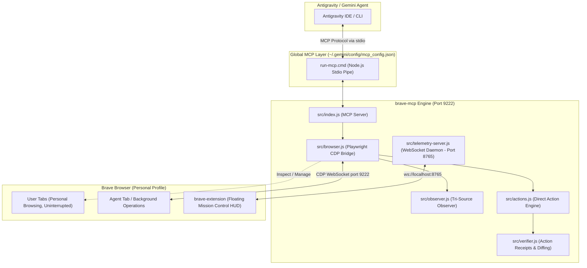

# Evidence-Grounded Brave Browser Agent (`brave-mcp`)

[](https://modelcontextprotocol.io/)
[](https://playwright.dev/)
[](https://brave.com/)
[](#1-parallel-co-browsing-zero-interruption)

Direct, evidence-grounded browser control bridge connecting **Antigravity / Gemini** directly to your active **Brave Browser** session via Playwright and the Chrome DevTools Protocol (CDP).

---

> [!IMPORTANT]
> **Academic Coursework Separation Notice**
>
> All STI College coursework, subject materials, and academic assignments have been cleanly decoupled from this repository.
> - **Coursework Workspace**: [`C:\Users\Godwyn\Documents\Projects\STI-College`](file:///C:/Users/Godwyn/Documents/Projects/STI-College)
> - **This Repository (`Browser activity`)**: Dedicated strictly to browser automation infrastructure, the CDP bridge MCP server, launcher utilities, companion extensions, and test suites.
> - **Global Availability**: The browser MCP server configured here serves the **entire computer globally** via `~/.gemini/config/mcp_config.json`. Any workspace (including `STI-College`) can automate Brave without duplicating code.

---

## 🏛️ System Architecture



---

## 🌟 Key Capabilities & Features

### 1. Parallel Co-Browsing (Zero Interruption)
- Operates inside a dedicated, isolated **Agent Window**.
- You can watch YouTube, read articles, or type in your personal tabs without the AI stealing focus, minimizing your windows, or hijacking mouse pointers.

### 2. Full Personal Profile Preservation
- Reuses your actual Brave profile (`Default`), preserving active logins, session cookies, bookmarks, extensions, and password managers.
- No dummy test profiles (`AgentProfile`) or repeated login captchas.

### 3. Brave Shields Ad & Tracker Immunity
- Automatically leverages Brave Shields to block intrusive cookie consent modals, paywalls, banner ads, and redirect trackers that frequently derail AI agents.

### 4. Tri-Source Ground Truth Observation
- Synthesizes DOM hierarchy, clean ARIA accessibility trees, and viewport screenshots to accurately resolve interactive elements.

### 5. Ephemeral Dynamic References (`e1`, `e2`, ...)
- Maps page elements to transient, concise tokens (`e1`, `e2`, `e3`).
- Eliminates fragile minified CSS selectors or fragile XPath trees.
- References are automatically invalidated upon page navigation to guarantee zero misclicks.

### 6. Token-Optimized Observation (~79% Token Reduction)
- Emits dense, single-line structured syntax for interactive elements.
- Drastically reduces context window consumption compared to raw HTML dumps or verbose JSON trees (verified 79% token savings).

### 7. Action Receipts & Evidence Diffing
- Every execution returns an evidence-grounded receipt comparing:
  - Before/after URL and title
  - DOM mutation status
  - Visual verification screenshot

---

## 🚀 Quick Start Guide

### Step 1: Launch Brave with Remote Debugging

Before Antigravity can attach, Brave must run with `--remote-debugging-port=9222`.

#### Option A: Immediate Restart Batch (One-Click)
Instantly closes and relaunches Brave with remote debugging and tab session restored:
```cmd
brave-launcher\launch-brave-now.cmd
```

#### Option B: Windows Interactive Batch Launcher
Double-click to check status and safely restart with debugging if already running:
```cmd
brave-launcher\launch-brave.cmd
```

#### Option C: PowerShell Script
```powershell
.\brave-launcher\launch-brave.ps1
```

#### Option D: Create a Permanent Connected Desktop Shortcut
Run this script once to create a permanent desktop shortcut that always opens Brave ready for AI connection:
```powershell
powershell -ExecutionPolicy Bypass -File .\brave-launcher\create-connected-shortcut.ps1
```

> [!TIP]
> If Brave is already running normally when you run the launcher, it will automatically offer to restart Brave with `--restore-last-session`, restoring all your active tabs and logins with debugging enabled.

---

### Step 2: Global Antigravity MCP Configuration

The MCP server is registered in your global configuration:
[`C:\Users\Godwyn\.gemini\config\mcp_config.json`](file:///C:/Users/Godwyn/.gemini/config/mcp_config.json)

```json
{
  "mcpServers": {
    "brave-control": {
      "command": "cmd.exe",
      "args": [
        "/c",
        "c:\\Users\\Godwyn\\Documents\\Projects\\Browser activity\\brave-mcp\\run-mcp.cmd"
      ]
    }
  }
}
```

*Because this configuration is global, any workspace in Antigravity has automatic access to `brave-control`.*

---

## 🛠️ The 6 Core MCP Tools Reference

| Tool | Primary Purpose | Key Parameters |
| :--- | :--- | :--- |
| [`brave_tabs`](#1-brave_tabs) | Manage & inspect open tabs | `action`, `index`, `url`, `bringToFront` |
| [`brave_observe`](#2-brave_observe) | Token-efficient DOM/ARIA observation | `target`, `scope`, `filter`, `format`, `includeScreenshot` |
| [`brave_act`](#3-brave_act) | Execute browser actions | `action`, `ref`, `text`, `key`, `direction`, `target` |
| [`brave_batch_act`](#4-brave_batch_act) | Sequential execution without LLM latency | `actions` (array of actions), `target` |
| [`brave_eval`](#5-brave_eval) | Direct in-page JavaScript execution | `script`, `target` |
| [`brave_navigate`](#6-brave_navigate) | Direct tab navigation & history | `url`, `action`, `target` |

---

### 1. `brave_tabs`
Inspects, switches, creates, or closes tabs across personal and agent browsing sessions.
- `action`: `"list"` (default), `"switch"`, `"new"`, `"close"`, `"focus"`
- `index`: 0-based tab index (for `"switch"`, `"close"`, `"focus"`)
- `url`: Destination URL for new tabs (for `"new"`)
- `bringToFront`: `boolean` (default `false` to avoid stealing user focus)

### 2. `brave_observe`
Extracts structured interactive element state with minimal token footprint.
- `target`: `"agent"` (default) or `"user"`
- `tabIndex`: Optional integer to observe a specific tab index directly
- `format`: `"compact"` (default, dense 1-line syntax saving ~79% tokens) or `"json"`
- `scope`: CSS selector restricting observation to a specific container (e.g. `"main"`, `"#search-results"`, `"form"`)
- `filter`: `"interactive"` (default), `"inputs"`, `"buttons_links"`, `"all"`
- `includeScreenshot`: `boolean` (default `false` for rapid reasoning)
- `maxElements`: Integer (default `60`)

### 3. `brave_act`
Executes an atomic browser action against the targeted tab.
- `action`: `"click"`, `"type"`, `"press"`, `"scroll"`, `"hover"`, `"select_option"`, `"upload_file"`
- `target`: `"agent"` (default) or `"user"`
- `tabIndex`: Optional integer to target a specific tab index
- `ref`: Ephemeral element reference from `brave_observe` (e.g. `"e1"`, `"e12"`)
- `obs_id`: Observation ID from `brave_observe` (recommended guard to reject stale element clicks)
- `text`: Text string to type (for `"type"`)
- `pressEnter`: `boolean` (press Enter immediately after typing)
- `key`: Key name (e.g. `"Enter"`, `"Tab"`, `"Escape"`, `"ArrowDown"`)
- `direction`: `"down"`, `"up"`, `"top"`, `"bottom"`
- `amount`: Scroll pixel magnitude (default `500`)
- `option`: Value or label to select (for `"select_option"`)
- `filePath`: Local file path to upload (for `"upload_file"`)

### 4. `brave_batch_act`
Executes an array of actions sequentially in a single turn without round-trip LLM delays.
- `actions`: Array of action objects following the `brave_act` schema
- `target`: `"agent"` or `"user"`
- `tabIndex`: Optional specific tab index
- **Returns**: Array of step receipts verifying sequential completion.

### 5. `brave_eval`
Executes arbitrary JavaScript directly in the tab context with zero token overhead.
- `script`: JavaScript code string (e.g. `document.title` or bulk DOM extractors)
- `target`: `"agent"` or `"user"`
- `tabIndex`: Optional specific tab index

### 6. `brave_navigate`
Controls tab navigation and history.
- `url`: Target web address (e.g. `"https://github.com"`)
- `action`: `"goto"` (default), `"reload"`, `"back"`, `"forward"`
- `target`: `"agent"` or `"user"`
- `tabIndex`: Optional specific tab index

---

## 📁 Repository Structure

```
Browser activity/
├── brave-mcp/                     # Core MCP Server & CDP Bridge
│   ├── package.json               # Dependencies: @modelcontextprotocol/sdk, playwright-core, ws
│   ├── run-mcp.cmd                # Launcher script called by global mcp_config.json
│   ├── src/
│   │   ├── index.js               # MCP Server entrypoint & tool registrations
│   │   ├── browser.js             # Playwright CDP connection & window isolation
│   │   ├── observer.js            # Tri-source observer & compact formatter
│   │   ├── actions.js             # Action executor & element locator
│   │   ├── verifier.js            # Action receipts & DOM state diffing
│   │   ├── paths.js               # Centralized path utilities & downloads routing
│   │   ├── telemetry-server.js    # WebSocket daemon (port 8765) for Mission Control HUD
│   │   └── telemetry.js           # Lightweight logging client
│   ├── scripts/                   # Modular automation scripts
│   │   ├── cdp/                   # Port 9222 diagnostics & connection checks
│   │   ├── gdrive/                # Google Drive automation & file organization
│   │   ├── social/                # Social media interaction scripts
│   │   └── scratch/               # Experimental scratch scripts
│   └── test/                      # Comprehensive test batteries
│       ├── test-connection.js     # Live CDP diagnostic test
│       ├── test-mcp-protocol.js   # MCP stdio protocol validation
│       ├── test-battery.js        # 14-point critical guarantee test battery
│       └── test-token-optimizations.js # Token savings & compact formatting test
├── brave-launcher/                # Brave startup & connection utilities
│   ├── launch-brave-now.cmd       # Instant restart with CDP port 9222 & restore session
│   ├── launch-brave.cmd           # Interactive double-click batch launcher
│   ├── launch-brave.ps1           # PowerShell launcher
│   └── create-connected-shortcut.ps1 # Permanent desktop shortcut generator
├── brave-extension/               # Companion browser extension & HUD
│   ├── manifest.json              # Manifest V3 extension definition
│   ├── background.js              # Service worker hot-reloader (port 8765)
│   ├── content/                   # Floating Mission Control HUD
│   └── popup/                     # Mission Control popup UI
├── artifacts/                     # [GITIGNORED] Runtime screenshots, test runs & temp data
├── .agents/skills/
│   └── website-automator/         # Playbook & scaffolding for zero-token browser skills
├── AGENTS.md                      # Developer instructions & anti-wandering constraints
└── README.md                      # Complete project documentation
```

---

## 🧪 Testing & Diagnostics Protocol

To verify server health, CDP connectivity, and protocol guarantees, run:

```bash
cd brave-mcp

# 1. Test live CDP connection to Brave (Port 9222)
npm test

# 2. Test MCP stdio protocol contracts (all 6 tools)
npm run test:protocol

# 3. Test token reduction & compact format engine
npm run test:tokens

# 4. Run the full 14-point critical test battery
npm run test:battery

# 5. Run all test suites sequentially
npm run test:all
```

---

## 🔧 Troubleshooting Guide

### 1. `Error: connect ECONNREFUSED 127.0.0.1:9222`
- **Cause**: Brave is either not running or was launched without remote debugging enabled.
- **Fix**: Run `brave-launcher\launch-brave.cmd`. If Brave is already open, accept the prompt to restart with session restore.

### 2. Antigravity does not list `brave-control` tools
- **Cause**: The MCP server is either not configured in `mcp_config.json` or path syntax has unescaped backslashes.
- **Fix**: Verify [`C:\Users\Godwyn\.gemini\config\mcp_config.json`](file:///C:/Users/Godwyn/.gemini/config/mcp_config.json) points to `c:\\Users\\Godwyn\\Documents\\Projects\\Browser activity\\brave-mcp\\run-mcp.cmd`.

### 3. Agent is stealing focus or clicking on personal tabs
- **Cause**: Actions are being directed to `target: "user"` instead of the default isolated `target: "agent"`.
- **Fix**: Ensure all autonomous operations specify or default to `target: "agent"`.
